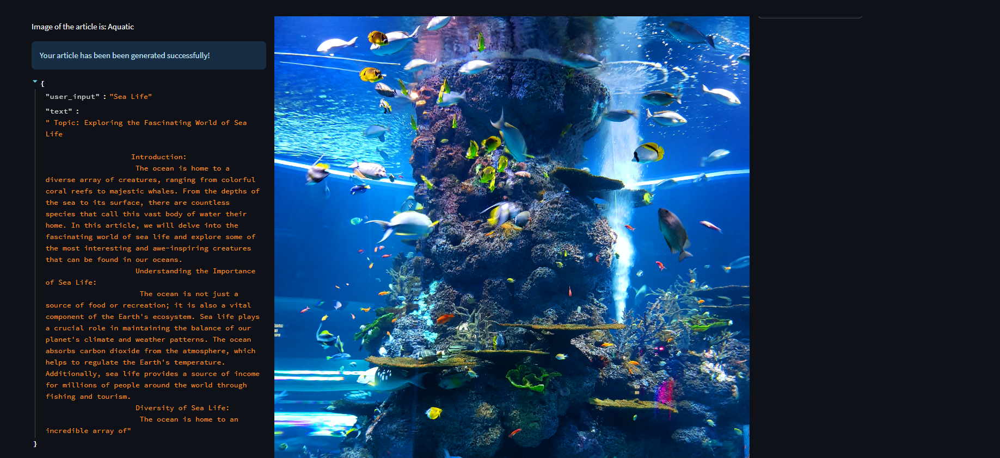

# Article Generator App using Llama 2

This is an application that generates articles using the Llama 2 language model. It also fetches an image related to the topic and creates a Word document containing the generated article and the fetched image.

## Overview

The Article Generator App uses the Llama 2 language model to create articles based on user-provided topics. The application fetches an image related to the topic using the Pexels API and incorporates it into a Word document alongside the generated article.

## Setup

1. Install Required Libraries:
   - `streamlit`
   - `docx`
   - `PIL` (Python Imaging Library)
   - `requests`

2. Obtain API Keys:
   - Pexels API Key: You need a Pexels API key to fetch images related to the topics.

3. Running the Application:
   - Run the `main()` function in the provided Python script using a Python interpreter.
   - Access the application through a web browser at the provided URL (usually `http://localhost:8501`).

## How to Use

1. Enter the Article Topic:
   - In the text input labeled "Please enter the idea/topic for the article you want to generate!", enter the topic or idea for the article you want to generate.

2. Enter the Image Topic:
   - In the text input labeled "Please enter the topic for the image you want to fetch!", enter a topic related to the image you want to fetch.

3. Article Generation:
   - The generated content will be displayed in the left column under "Generated Content by Llama 2".
   - A prompt template is used to instruct the Llama 2 model to generate content based on the provided topic.

4. Fetched Image Display:
   - The fetched image related to the image topic will be displayed in the center column under "Fetched Image".

5. Download Word Document:
   - The generated article and the fetched image will be combined into a Word document.
   - Click the "Download Word Document" button in the right column to download the document.

## Acknowledgments

- This application uses the Llama 2 language model for article generation.
- It fetches images using the Pexels API.

## License

This project is licensed under the [MIT License](LICENSE).

## UML

## Demo

- Visiting window

- User Input

- Result

- Download

